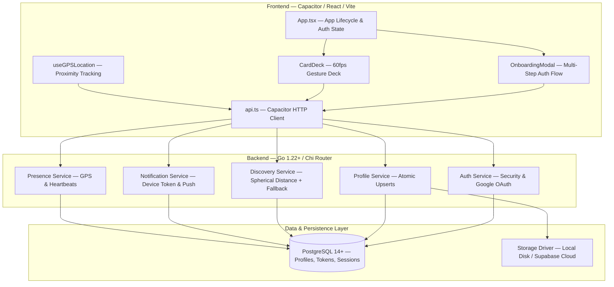

# 📍 Kinjo — Location-Based Social Discovery Platform

Kinjo is a modern, real-time **location-based social discovery platform** designed to connect people who are physically nearby (within a **30-meter radius**). Users can discover local creators, professionals, and innovators around them through a high-performance, 60fps swipeable card deck interface.

---

## 🌐 Current Active Backend & Ngrok Tunnel Setup

- **Backend API Engine**: Go 1.22+ API server running locally on **`http://localhost:8080`**.
- **Active Database**: Connected to Supabase Cloud PostgreSQL (`aws-0-ap-southeast-1.pooler.supabase.com`).
- **Mobile & Web HTTPS Tunnel**: Frontend `.env.local` configures `VITE_API_URL=https://be81-14-194-0-162.ngrok-free.app/api`.
  - **Why Ngrok?**: Android native apps and browser security policies require an HTTPS endpoint for Google OAuth popup verification, camera face-verification APIs, and Capacitor native HTTP network calls.

---

## 🌟 Key Features & Capability Matrix

### 🔐 1. Multi-Channel Authentication & Security
- **Dual-Channel Authentication**: Supports both **OTP Email Verification** and **Google OAuth 2.0** with window popup flow (`email_verified = TRUE`).
- **Account Lockout Protection**: Automatic **15-minute account lock** after 5 consecutive failed password attempts to prevent brute-force attacks.
- **BCrypt & SHA-256 Hashing**: Passwords stored using salted bcrypt; session tokens hashed with SHA-256 in PostgreSQL.
- **XSS & Data Protection**: HTML bio sanitization and input escaping on user profile creation.

### 🤳 2. TensorFlow.js Live Face Verification
- **Real Human Verification**: Integrated browser and native TensorFlow.js BlazeFace model to verify real human presence before profile setup.
- **Accessibility Fallback**: Accessible skip option for compatibility and fallback testing.

### 👤 3. Profile Creation & Atomic Database Writes
- **Zero Premature Writes**: Authentication (Google or Email) creates only verified session states; user profile data is written to PostgreSQL **ONLY** when the user explicitly clicks the **"Save profile"** button.
- **Dynamic Image Processing**: High-DPI 1080p WebP/JPEG image compression (`compressImage`) before upload.

### 🎯 4. Conditional 30-Meter Proximity Discovery Deck
- **30m Strict Radius**: Queries nearby profiles using PostgreSQL spherical distance calculations within a 30m physical radius.
- **Conditional Stack Fallback**: If active card count is **< 30**, automatically expands radius to query profiles outside 30m sorted by closest distance to present up to 30 total cards.

### 📱 5. Native Mobile Support & Capacitor Integration
- **Cross-Platform Mobile**: Native Android and iOS application powered by Capacitor JS.
- **Hardware Integration**: Hardware back-button handling, native GPS geolocation tracking, and app lifecycle state listening.

### 🔔 6. Native & Custom Push Notifications System
- **Device Token Tracking**: Automatically registers native device tokens (`device_tokens` table) upon user login.
- **Custom Notification API**: Exposes `POST /api/notifications/send-custom` for sending targeted system & custom push notifications.
- **Proximity Alerts**: Trigger notification events when users step within 30m of each other.

---

## 🔔 Custom Push Notifications Guide & Testing

### Sending Custom Notifications via API (cURL / Postman / Admin Tools)

You can send custom notifications to **any user** via HTTP API.

- **Endpoint**: `POST /api/notifications/send-custom` (or `POST /api/v1/notifications/send-custom`)
- **Headers**:
  - `Content-Type: application/json`
  - `Authorization: Bearer <YOUR_JWT_AUTH_TOKEN>`

#### **cURL Command**:
```bash
curl -X POST http://localhost:8080/api/notifications/send-custom \
  -H "Content-Type: application/json" \
  -H "Authorization: Bearer YOUR_AUTH_JWT_TOKEN" \
  -d '{
    "target_email": "user@example.com",
    "title": "Nearby Connection Alert 🚀",
    "body": "Someone with matching interests just stepped within 30 meters of you!",
    "data": {
      "type": "proximity_alert",
      "distance": 25
    }
  }'
```

#### **JSON Request Schema**:
```json
{
  "target_email": "string (Required: Email address of recipient)",
  "title": "string (Required: Push Notification Title)",
  "body": "string (Required: Push Notification Body/Message)",
  "data": {
    "key": "value (Optional: Custom key-value JSON metadata)"
  }
}
```

---

## 🏗️ Technology Stack Architecture



### Tech Stack Details:
- **Frontend**: React 18, TypeScript, Vite, Tailwind CSS, Lucide Icons, TensorFlow.js BlazeFace.
- **Mobile Native**: Capacitor JS (`@capacitor/core`, `@capacitor/geolocation`, `@capacitor/push-notifications`, `@capacitor/app`, `@shardev/capacitor-google-auth`).
- **Backend API**: Go 1.22+, Chi Router (`github.com/go-chi/chi/v5`), `pgx/v5` PostgreSQL connection pool.
- **Observability**: Structured JSON Logging (`log/slog`), Prometheus Metrics (`/metrics`), Health Checks (`/api/healthz`, `/api/readyz`).

---

## 💾 File Storage Architecture

Kinjo provides an abstraction interface (`storage.Storage`) for handling user profile photos:

1. **`STORAGE_DRIVER=local` (Default — Self-Hosted)**:
   - Saves uploaded avatars directly to server disk (`./uploads/`).
   - Served publicly via HTTP at `/uploads/{filename}`.
   - **Cost**: **$0 / FREE** (Uses local disk).

2. **`STORAGE_DRIVER=supabase` (Cloud Storage Bucket)**:
   - Uploads binary photo data to a public Supabase Storage bucket (`avatars`).
   - Returns public CDN URLs.

---

## 🚀 Quick Start & Local Development

### 1. Prerequisites
- **Node.js**: v18+ and `npm`
- **Go**: v1.22+
- **PostgreSQL**: v14+ (Local or Supabase)

### 2. Backend Setup (`/backend/backend-go`)
```bash
cd backend/backend-go

# Copy environment file
cp .env.example .env

# Run Go API server (automatically runs SQL migrations on startup)
go run ./cmd/api
```
Server runs on `http://localhost:8080`.

### 3. Frontend Setup (`/frontend`)
```bash
cd frontend
npm install
npm run dev
```
React web app opens at `http://localhost:5173`.

### 4. Ngrok Mobile Testing Tunnel (Optional for Local Mobile Device Testing)
```bash
ngrok http 8080
```
Update `VITE_API_URL` in `frontend/.env.local` to your generated Ngrok HTTPS URL.

---

## 📱 Mobile Build & Android APK Generation

```bash
cd frontend

# 1. Build Vite web bundle & sync Capacitor assets
npm run build
npx cap sync android

# 2. Build Debug Android APK
cd android
./gradlew assembleDebug
```

Compiled APK Location:
`frontend/android/app/build/outputs/apk/debug/app-debug.apk`

---

## 📖 Deployment & Production Guide

For the complete step-by-step production deployment guide (Nginx setup, Systemd configuration, Let's Encrypt SSL, PostgreSQL database setup, and Push Notification credentials), see [DEPLOYMENT_GUIDE.md](file:///home/yaxh/Documents/silver-sniffle/DEPLOYMENT_GUIDE.md).
